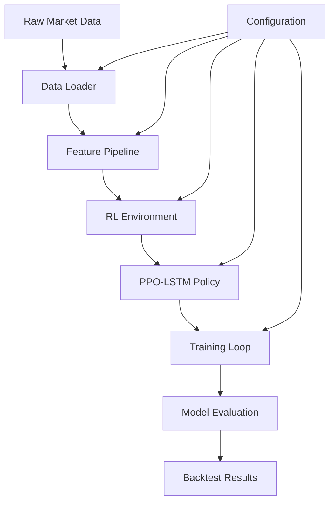
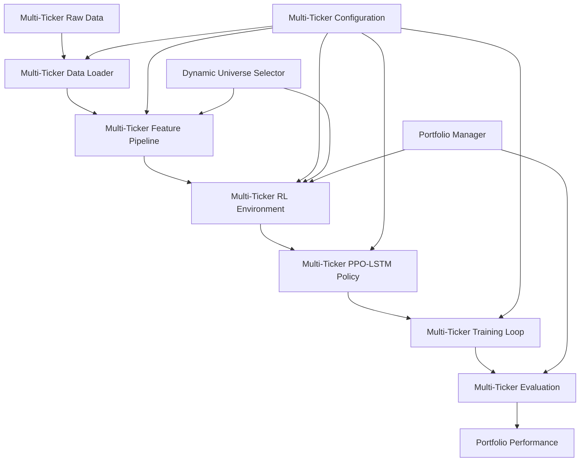
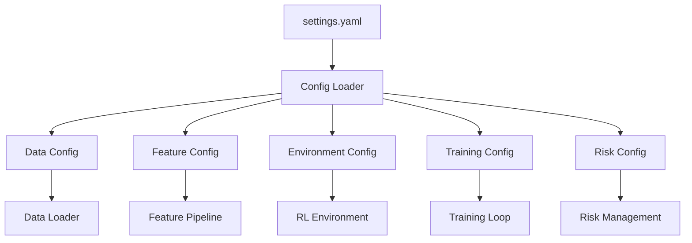
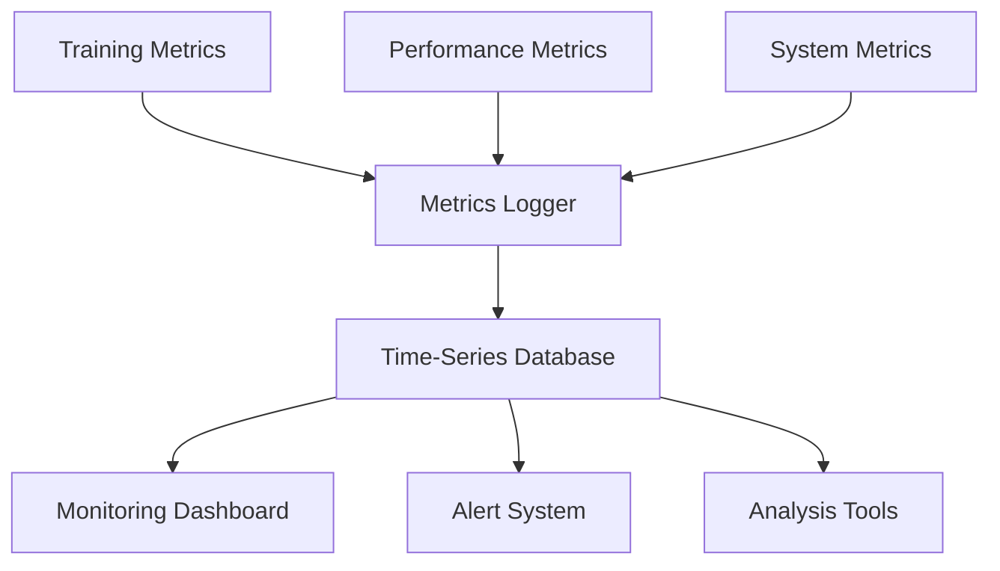

# Data Flow Architecture

## Overview
This document describes the end-to-end data flow through the RL trading system, from raw market data ingestion to model training and evaluation. Understanding this flow is crucial for implementing the multi-ticker and reward overhaul.

## Current Data Flow (Single Ticker)



## Detailed Data Flow Stages

### 1. Data Ingestion & Loading

**Input**: Raw market data files (Polygon/Databento format)
**Processing**: 
- Data partitioning by symbol and date
- Timestamp canonicalization and timezone handling
- Regular Trading Hours (RTH) enforcement
- Data validation and quality checks
- Caching for performance optimization

**Key Classes**:
- `UnifiedDataLoader` in `src/data/data_loader.py`

**Output**: Clean, aligned OHLCV data with additional fields

```python
# Example output structure
{
    'timestamp': pd.DatetimeIndex,
    'open': float,
    'high': float,
    'low': float,
    'close': float,
    'volume': int,
    'vwap': float,  # If available
    'transactions': int,  # If available
}
```

### 2. Feature Engineering

**Input**: Clean OHLCV data from data loader
**Processing**:
- Technical indicators (SMA, EMA, RSI, MACD, etc.)
- Microstructure features (spread, microprice, order flow imbalance)
- Time-based features (time of day, day of week, session features)
- Advanced features (VPA, ICT, volatility, SMT, levels)
- Feature normalization and selection
- PCA for dimensionality reduction (microstructure features)

**Key Classes**:
- `FeaturePipeline` in `src/features/pipeline.py`
- Various feature calculators in `src/features/` submodules

**Output**: Feature matrix with engineered features

```python
# Example output structure
{
    'timestamp': pd.DatetimeIndex,
    'sma_20': float,
    'ema_12': float,
    'rsi_14': float,
    'macd': float,
    'spread': float,
    'vwap': float,
    'time_of_day_sin': float,
    'time_of_day_cos': float,
    # ... additional features
}
```

### 3. RL Environment

**Input**: Feature matrix, model actions
**Processing**:
- Market state observation construction
- Action validation and execution
- Position management and P&L calculation
- Reward computation (multiple types: pnl, dsr, sharpe, hybrid2)
- Risk management and position sizing
- Episode termination conditions

**Key Classes**:
- `IntradayRLEnv` in `src/sim/env_intraday_rl.py`
- `IntradayRLEnvironment` (compatibility wrapper)

**Output**: Observations, rewards, done signals, info dict

```python
# Example output structure
{
    'observation': np.ndarray,  # Feature vector
    'reward': float,  # Calculated reward
    'done': bool,  # Episode termination flag
    'info': {
        'pnl': float,
        'position': int,
        'action': int,
        'bar_return': float,
        'atr': float,
        # ... additional info
    }
}
```

### 4. PPO-LSTM Policy

**Input**: Observations from environment
**Processing**:
- LSTM-based feature extraction
- Policy and value network forward passes
- Action probability distribution calculation
- Value function estimation

**Key Classes**:
- `PPOLSTMPolicy` in `src/rl/ppo_lstm_policy.py`
- `LSTMFeatureExtractor`
- `SharedFeatureExtractor`

**Output**: Action probabilities, value estimates

```python
# Example output structure
{
    'actions': np.ndarray,  # Action probabilities
    'values': np.ndarray,  # Value estimates
    'log_prob': np.ndarray,  # Log probabilities
}
```

### 5. Training Loop

**Input**: Environment rollouts, policy outputs
**Processing**:
- Experience collection and storage
- Advantage calculation (GAE)
- PPO loss computation
- Policy gradient updates
- Entropy regularization
- Learning rate scheduling
- Model checkpointing

**Key Classes**:
- `RLTrainer` in `src/rl/train.py`
- `TrainingConfig`

**Output**: Trained model, training logs

```python
# Example output structure
{
    'model': PPOLSTMPolicy,  # Trained model
    'training_logs': {
        'loss': float,
        'policy_loss': float,
        'value_loss': float,
        'entropy_loss': float,
        'explained_variance': float,
        # ... additional metrics
    }
}
```

### 6. Model Evaluation

**Input**: Trained model, test data
**Processing**:
- Historical simulation
- Performance metrics calculation
- Risk analysis
- Trade statistics generation
- Equity curve construction

**Key Classes**:
- `BacktestEvaluator` in `src/evaluation/backtest_evaluator.py`
- `MetricsCalculator` in `src/evaluation/metrics.py`

**Output**: Performance reports, visualizations

```python
# Example output structure
{
    'total_return': float,
    'sharpe_ratio': float,
    'max_drawdown': float,
    'win_rate': float,
    'total_trades': int,
    'equity_curve': pd.Series,
    'trade_history': List[Dict],
    # ... additional metrics
}
```

## Multi-Ticker Data Flow (Target Architecture)



### Multi-Ticker Enhancements

#### 1. Multi-Ticker Data Loading
- Simultaneous loading of multiple tickers
- Cross-ticker time alignment
- Ticker-specific metadata management
- Data quality checks per ticker

#### 2. Multi-Ticker Feature Pipeline
- Ticker-specific feature normalization
- Cross-ticker relative features
- Sector-based feature aggregation
- Correlation-aware feature selection

#### 3. Multi-Ticker RL Environment
- Portfolio-level state representation
- Multi-dimensional action space
- Portfolio-level reward calculation
- Cross-ticker risk management

#### 4. Multi-Ticker PPO-LSTM Policy
- Ticker-specific LSTM pathways
- Cross-ticker attention mechanisms
- Portfolio-level policy heads
- Shared feature extractors

#### 5. Multi-Ticker Training Loop
- Leave-One-Ticker-Out cross-validation
- Walk-Forward Optimization
- Multi-objective hyperparameter optimization
- Population-Based Training (optional)

#### 6. Multi-Ticker Evaluation
- Portfolio performance metrics
- Ticker-specific performance attribution
- Risk analysis across tickers
- Regime-based performance analysis

## Data Flow Optimization

### Caching Strategy
- Data caching at multiple levels
- Feature caching for expensive computations
- Model checkpointing for training resumption

### Parallelization
- Parallel data loading for multiple tickers
- Parallel feature engineering
- Parallel environment rollouts
- Distributed training support

### Memory Management
- Streaming data processing for large datasets
- Efficient data structures for multi-ticker data
- Memory-mapped file support
- GPU memory optimization

## Configuration Flow



## Monitoring & Logging Flow



## Error Handling & Recovery

### Data Validation
- Schema validation at each stage
- Outlier detection and handling
- Missing data imputation strategies
- Data quality scoring

### Fault Tolerance
- Checkpointing at critical stages
- Graceful degradation on failures
- Automatic recovery mechanisms
- Fallback strategies

### Audit Trail
- Complete data lineage tracking
- Configuration versioning
- Model provenance tracking
- Performance attribution logging